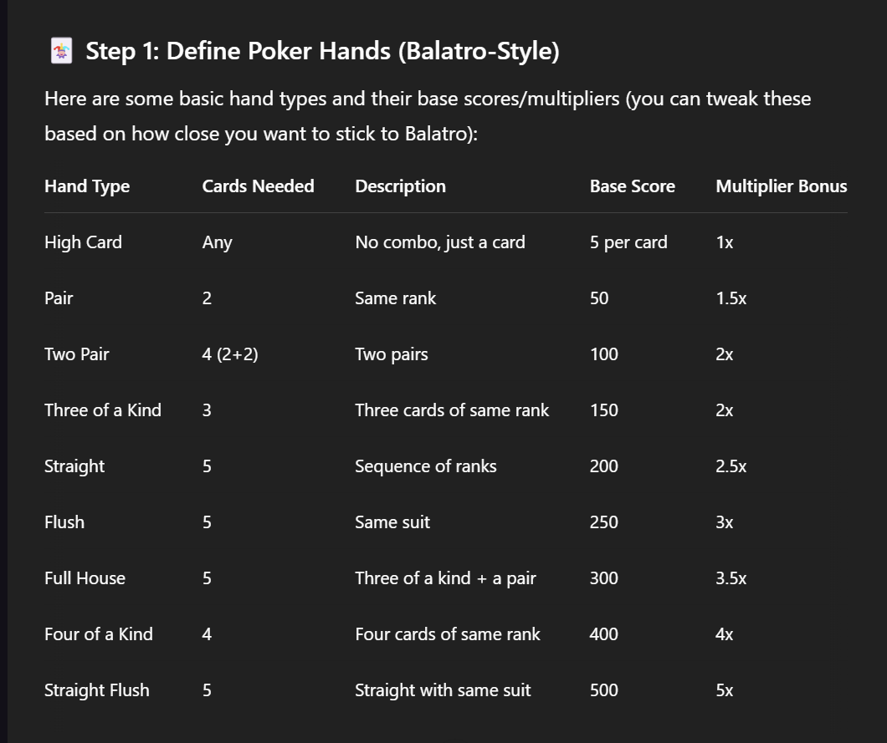

# Idea Chính

Game card có cơ chế của HSR (Honkai Starail) kết hợp với cả cơ chế có sẵn giống với balatro.

## Cấu tạo quái

Quái có các thuộc tính như:
- Thanh sức bền
- Thanh máu
- Damage
- Thuộc tính quái (Hiển thị điểm yếu quái)
- Lượt hành động

## Cấu tạo lá bài

Lấy cảm hứng từ bộ bài tây

## Cấu tạo heroes
- HP
- ATK
- SHD
- LIST<EFFECTED>

- Role
- 

## Heroes

Có 3 loại heroes:
- DPS
- Buffer
- Debuffer

Người chơi có thể chọn 3 heroes tham gia mỗi lần chơi.

## Phân loại Heroes

Có 2 dạng phân loại bài chính:
- Phân loại theo hệ: Hỏa, Thổ, Thủy và Phong
- Phân loại theo hiệu ứng của Heroes: DOT (Damage Over Time: Độc, chảy máu,...), Khống chế cứng (Đóng băng, sốc điện), Hiệu ứng tích sát thương (Cần đạt số lượng cộng dồn để gây sát thương), Hiệu ứng phá vỡ điểm yếu (Break Effect), Hiệu ứng hồi máu, Hiệu ứng khiêu khích và vân vân mây mây.

 

## Người chơi
Người chơi sẽ có các thuộc tính sau:
- Số tiền người chơi sở hữu

## License

This project is licensed under the MIT License

Background trippy
#003C2F
Background
#319679
